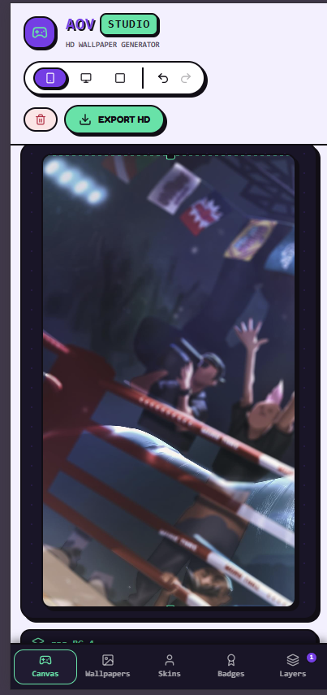
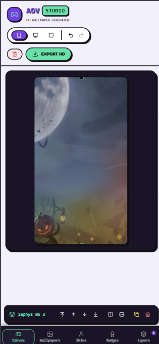

# 🎮 Arena of Valor (AOV) Wallpaper Studio

A modern, lightweight, high-performance web application to create custom **Arena of Valor (AOV)** HD wallpapers, mobile wallpapers, profile avatars, and banner artwork. Built with **React 18**, **Vite 6**, **Konva.js**, and **TailwindCSS**.



---

## 🌟 Key Features

- 🎨 **Whimsical Retro Arcade Theme**: Designed with custom Arcade styling (`#7C3AED` Purple, `#00E5A3` Mint, and `#120E16` Dark Arcade borders).
- 🖼️ **Complete Asset Library**: Over 1,280+ localized HD wallpapers, portrait hero skin cutouts, TW title badges, and game icons.
- 📱 **Mobile & Desktop Optimized UX**: 
  - Dedicated **Mobile Bottom Navigation Menu** (*Canvas*, *Wallpapers*, *Skins*, *Badges*, *Layers*).
  - Smart asset workflow: Selecting a Wallpaper automatically directs you to choose a Hero Skin next.
  - Floating layer quick controls toolbar below canvas.
- 👆 **Native Multi-Touch Gesture Support**:
  - **Pinch-to-Scale**: Smoothly resize layers with 2-finger pinch gestures on mobile devices.
  - **Pinch-to-Rotate**: Rotate layers intuitively using 2-finger rotation on mobile screens.
- 📐 **Multiple Resolution Presets**:
  - **Mobile (9:16)**: 1080 x 1920 HD
  - **Desktop (16:9)**: 1920 x 1080 HD
  - **Square (1:1)**: 1080 x 1080 HD
- ✏️ **Text Studio**: Custom typography with live Google Fonts (Fredoka, Staatliches, Impact, etc.), text stroke, fill color picker, and text alignment.
- 🥞 **Full Layer Management**: Reorder layers (Bring to Front, Move Up/Down, Send to Back), horizontal/vertical flip, duplicate, and delete layers with full history undo/redo support.
- ⚡ **Asset Fetching CLI**: Integrated `add-hero.js` script to automatically probe Garena CDN servers and download assets for new hero releases.

---

## 📱 Mobile Preview



---

## 🛠️ Tech Stack

- **Framework**: React 18 & Vite 6
- **Canvas Engine**: Konva 9 (`react-konva`)
- **Styling**: TailwindCSS & Lucide React Icons
- **Deployment**: Static GitHub Pages via GitHub Actions workflow

---

## 🚀 Getting Started

### 1. Install Dependencies

```bash
npm install
```

### 2. Run Development Server

```bash
npm run dev
```

### 3. Build for Production

```bash
npm run build
```

---

## 🗡️ Adding New Heroes

If a new hero is released in Arena of Valor, you can easily probe and download all new backgrounds and skin cutouts from the server using the CLI script:

```bash
node add-hero.js <hero_name>
```

**Example:**
```bash
node add-hero.js biron
```

The script will automatically check available CDN assets, update `src/data/heroes.js`, and save localized images into `public/images/hero/<hero_name>/`.

---

## 📄 License

MIT License. Designed & Developed for the Arena of Valor Community.
